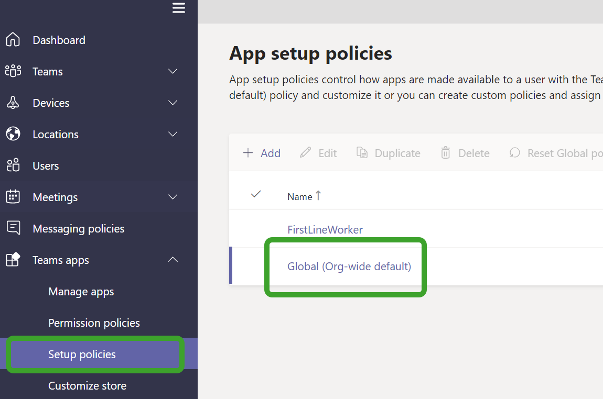
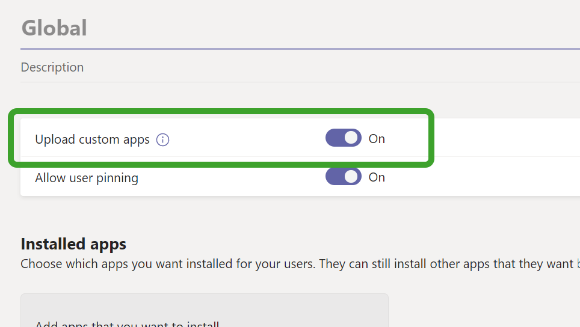

# Building Microsoft Teams Tabs using SharePoint Framework

Starting with SharePoint Framework v1.8, you can build tabs for Microsoft Teams with the SharePoint Framework tooling and use SharePoint as a host for your solutions. As part of the SharePoint Framework v1.10 you can also publish your solution as Microsoft Teams personal app.

The benefits to use the SharePoint Framework as the platform for your Microsoft Teams tabs include the following:

- Development model is similar to SharePoint Framework web parts
- Any web part can be exposed as a tab or personal app in Microsoft Teams
- The different scoping options to expose a custom tab as a web part and tab in your tenant
- Your tab will be executed in the context of the underlying SharePoint site behind of the specific team. This means that you can take advantage of any SharePoint specific APIs or functionalities in your web part.

## Development process

You can start developing Microsoft Teams tabs simply by using the SharePoint Framework 1.8 or later packages. The high-level steps to get started are as follows:

> [!NOTE]
> Refer to the detailed steps to get started from the [Building Microsoft Teams tab using SharePoint Framework - Tutorial](web-parts/get-started/using-web-part-as-ms-teams-tab.md) that contains additional important details you must follow.

1. Create a SharePoint Framework solution with a client-side web part
1. Add `"TeamsTab"` to the `supportedHosts` property of the web part manifest to use it as a tab in a channel:

    ```json
    "supportedHosts": ["SharePointWebPart", "TeamsTab"],
    ```

1. Add `"TeamsPersonalApp"` to the `supportedHosts` property of the web part manifest to use it as a personal app:

    ```json
    "supportedHosts": ["SharePointWebPart", "TeamsPersonalApp"],
    ```

1. Deploy the web part using tenant-scoped deployment option to your SharePoint app catalog
1. Activate the SharePoint Framework solution, which you deployed and select **Sync to Teams** button in the App Catalog

## Deployment options

There are multiple options to deploy Microsoft Teams tab or as a personal app. As both SharePoint and Microsoft Teams have their own app catalog, deployment requires operations on both services. Visibility of the new functionality can be controlled by the deployment steps taken.

### Tenant deployment

You can use the **Sync with Teams** button in the App Catalog ribbon that will automatically create the Microsoft Teams app manifest, app package and install it in the Microsoft Teams store. This will make your solution available for all users in your tenant and Microsoft Teams teams.

### Alternative deployment options

There's an alternative way to deploy your solution, which will for instance allow you to make a solution available only to one specific team in your tenant. See [Create Microsoft Teams manifest manually for a web part and deploy it to Microsoft Teams](./web-parts/guidance/creating-team-manifest-manually-for-webpart.md) for details on how to create the manifest.

1. Build your SharePoint Framework solution the normal way:

    ```console
    gulp bundle --ship
    gulp package-solution --ship
    ```

1. Locate the **./teams** folder in your project folder:

    

1. Notice the two image files in the **./teams** folder. Add the manifest file you created as described in [Create Microsoft Teams manifest manually for a web part and deploy it to Microsoft Teams](./web-parts/guidance/creating-team-manifest-manually-for-webpart.md) to this folder. This file should be named ***manifest.json**.
1. After you added the manifest to the **./teams** folder, zip the contents of the folder into a zip file. This means that the zip file should only contain the manifest.json and the two images.
1. Add your solution to the app catalog and make sure to select the option **Make this solution available to all sites in the organization** before selecting **Deploy**

### Turn on side loading of external apps in Teams

To upload an app for a specific team, you'll have to enable side loading. The following configuration steps must be done only **once** in a tenant.

1. Navigate to the **Microsoft 365 Teams Admin center** / **App Setup policies** by  going to "https://admin.teams.microsoft.com/policies/app-setup" 
    
    

1. Select the Global policy (or create a new one). Make sure the "Upload custom apps" setting is enabled.

    

1. Select **Save**:

    > [!NOTE]
    > The side loading configuration to be done only once in a tenant. For more information on preparing your Microsoft 365 tenant for Microsoft Teams development, see [Microsoft Teams developer documentation](https://docs.microsoft.com/microsoftteams/platform/get-started/get-started-tenant#turn-on-microsoft-teams-for-your-organization).

1. Move to your Microsoft Teams instance by selecting **Teams** in the app launcher:

    

1. Choose a Team that you want to use for testing the capability and select **Manage team** from the `...` menu:

    

1. Move to **Apps** tab.
1. Choose **Upload a custom app** from the bottom-right corner.

    > [!NOTE]
    > If this setting is not available, side loading is not enabled in the tenant which you are using. Double check the settings from the tenant admin UIs.

    

1. Upload the Microsoft Teams app manifest file your created earlier from the **./teams** folder under your newly created solution and ensure that it's properly visible in the list of Apps. Notice how the custom image is visible with the description of the solution:

    

1. Move to a channel in the Team where you uploaded the solution. In the following image, notice we've activated the **General** channel in **Team**

    

1. Select **+** to add a new tab on the channel.
1. Select your custom tab named **MyFirstTeamTab** in the list:

    

1. Notice how you can customize the tab instance using the exposed properties on the web part. Select **Save**:

    

## Detecting if web part is in Teams context

The page context in a web part contains a reference to the Teams JavaScript SDK so that you can easily get access on the Teams context when your web part is rendered as a tab.

```javascript
this.context.sdks.microsoftTeams
```

> [!NOTE]
> For more information on the Microsoft Teams tab context, see [Microsoft Teams development documentation](https://docs.microsoft.com/microsoftteams/platform/concepts/tabs/tabs-context?view=msteams-client-js-latest).

> [!IMPORTANT]
> The property `this.context.microsoftTeams` has been deprecated in the SharePoint Framework v1.10 release.
>
> You should use `this.context.sdks.microsoftTeams` for all solutions created with the SharePoint Framework v1.10 and later.

## See also

- [Building Microsoft Teams tab using SharePoint Framework - Tutorial](web-parts/get-started/using-web-part-as-ms-teams-tab.md)
- [Upload an app package to Microsoft Teams](https://docs.microsoft.com/microsoftteams/platform/concepts/apps/apps-upload)
- [Tenant-scoped solution deployment for SharePoint Framework solutions](https://docs.microsoft.com/sharepoint/dev/spfx/tenant-scoped-deployment)
